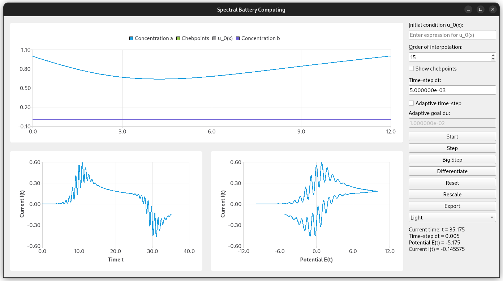

# Welcome

This is a Case Study in Scientific Computing.



In the [report](https://raw.githubusercontent.com/MrP01/BatteryComputing/master/report/report.pdf),
we will introduce necessary mathematical background on Laplace
transforms and Chebyshev polynomials (Section 2), obtain an analytical solution
using a similarity solution and Laplace-transform approach in Section 3, discuss the
finite difference scheme one can use to solve the problem numerically in Section 4 and
finally introduce the Chebyshev spectral method used for most results in this report
(Section 5).

## Usage & Compilation Instructions

The Python code can be found in `Full_Solution.py`.
The MatLab "code" for the numerical solution of the 1d and 2d cases is located in `Matlab`.

To compile the spectral solver, please run

```bash
mkdir build/
conan install . --output-folder=build --build=missing
cd build/
cmake .. -DCMAKE_BUILD_TYPE=Release
make -j4
cd ../
```

and then run either `./build/main` for the GUI or `./build/generatePlots` to reproduce the spectral results (located in `results` along with other diagrams).
